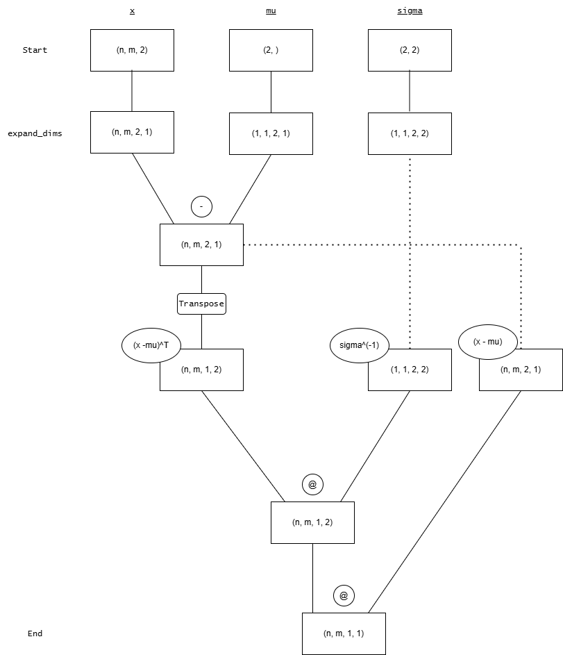

# Sample Statistics and Gaussians Exercise

Today's exercise first explores sample statistics like mean and variance.
It continues with the definition of the gaussian distributions.
It ends with applying gaussian mixture models (gmm) and the expectation-maximization algorithm used to optimize gmm.

### ⊙ Task 1: Mean and Variance

- To get started, take a look at the `src/sample_mean_corr_rhein.py` file.

Implement functions to compute sample mean and the standard deviation.
1. Use

$$ \hat{\mu} = \frac{1}{n} \sum_{i=1}^n x_i , $$

to calculate the mean.

2. Use 

$$ \hat{\sigma} = \sqrt{\frac{1}{n-1} \sum_{i=1}^n (x_i - \hat{\mu})^2} $$

to compute the standard deviation. 

$x_i \in \mathbb{R}$ for $i \in \{1, ... , n\}$ denotes individual sample elements, and $n \in \mathbb{N}$ the size of the sample.
Don't use the pre-build functions np.mean() or np.std() to solve these tasks.  

Return to the Rhine data-set and go to the `__main__`-function. 
The data from `./data/pegel.tab` is already loaded and processed and is ready to be used. 
3. Compute the water level mean and standard deviation before the year 2000.
4. And now compute the water level mean and standard deviation after the year 2000.

### ⊙ Task 2: Autocorrelation
We now want to use autocorrelation to analyse the discrete time signal of the rhine level measurements. Implement the `auto_corr` function in `src/sample_mean_corr_rhein.py`. It should implement the engineering version without the normalization and return the autocorrelation

$$ R_{xx} = (c_{-N+1},\ldots,c_{1}, c_0, c_{1}, \ldots, c_{N-1}) $$

with

$$        c_{k} = \sum_{t=1}^{N-|k|} n_t n_{t + |k|}$$

with $n$ the normalized version of your signal of length $N$. The time shift $k$ moves from $-(N-1)$ to $N-1$. Therefore, the resulting array has a length of $2N-1$. 

For example the autocorrelation of an input signal $x=(2,3,-1)$ is $R_{xx}=(c_{-2}, c_{-1}, c_0, c_1, c_2)=(-2, 3, 14, 3, -2)$ and is symmetrical.

>> In the following table you can see an illustrative depicition on how the $c_k$'s are calculated.
The header contains the input signal x padded with 0's on its sides.
For autocorrelation, we compute correlation between $x$ and $x$ itself.
So in visual terms, we slide $x$ from left to right across itself. 
At each step we compute one $c_k$ by first multiplying the numbers that are aligned with the input signal in the header. Then, these products will be summed up. The result is written in the respective cell of the last column.

| 0    | 0 | 2 | 3 | -1 | 0 | 0 | $c_k$ | 
| -------- | ------- | ------- | ------- | ------- | ------- | ------- | ------- | 
| 2  | 3 | -1 | | | | | 0 + 0 - 2 = -2
|  | 2  | 3 | -1 |  | | | 0 + 6 - 3 = 3
| | | 2  | 3 | -1 | | | 4 + 9 + 1 = 14
| | | | 2  | 3 | -1 | | 6 - 3 + 0 = 3
| | | | | 2  | 3 | -1 | -2 + 0 + 0 = -2
>> As you can see, when reading from top to bottom we get the correct solution $R_{xx}=(-2, 3, 14, 3, -2)$.

So here are your tasks:
1. Implement the `auto_corr` function as described above. 
    >> The function expects $x$ to be normalized. That means, that no normalization is done inside the `auto_corr`-function. Instead you normalize the input signal before calling `auto_corr`.
2. Check your implementation using `nox -s test`.
    If the test passes you can use `np.correlate` for efficiency in the following exercises!

Now go back to the `__main__`-function and consider the Rhine data-set after 2000.
3. Normalize the data of the Rhine level measurements since 2000 via 

    $$ n_{t} = \frac{x_{t} - \hat{\mu}}{\hat{\sigma}} ,$$

    for all $t$ measurements until the signal length N.
4. Compute and plot the autocorrelation for the Rhine level measurements since 2000.

Now we want to compare this autocorrelation to the one of a random signal.
5. Create a random signal from `np.random.randn` that has the same shape as the Rhine level measurements
6. Normalize the random signal.
7. Compute the autocorrelation of the normalized, random signal.
8. Plot both autocorrelations of the Rhine level measurements and the random signal using `plt.plot` and compare the results.


### ⊙ Task 3: Distributions

1. Consider the `src/plot_gaussian.py` module. Implement the `gaussian_pdf` function.

    In one dimension gaussian probability density function is defined as

    $$\phi_1(x | \mu, \sigma) = \frac{1}{\sqrt{2\pi \sigma^2}} \exp({-\frac{1}{2}(\frac{x - \mu}{\sigma})^2}) .$$

    $\pi \in \mathbb{R}$ denotes Pi, $\mu \in \mathbb{R}$ the mean and $\sigma \in \mathbb{R}$ the standard deviation for a random variable $X$. 
    $e^x$ denotes the exponential function. 
    A random variable $X$ having a gaussian pdf is described as gaussion or normal distribution $\mathcal{N}$.
    >> Remark: In the notation $\phi_1(x | \mu, \sigma)$, x is the variable that is plugged into the function and $\mu$ and $\sigma$ are parameters which are needed to define the function and that are determined beforehand.
2. Explore the behavior of $\mathcal{N}(\mu, \sigma)$ for different values of $\mu$ and $\sigma$.
  The Code for plotting the pdf's is already given.


3. Consider the `src/mixture_concepts.py` module. 
Go to the `twod_gaussian_pdf`-function and implement a two-dimensional gaussian pdf following,

    $$ \phi_2(\mathbf{x} | \mu_g, \Sigma_g) = \frac{1}{\sqrt{(2\pi)^2 \| \Sigma_g \|}} \exp({-\frac{1}{2}(\mathbf{x}-\mu_g)^T \Sigma_g^{-1}(\mathbf{x}-\mu_g)}).$$

    $\mu_g \in \mathbb{R}^2$ denotes the two dimensional mean vector, $\Sigma_g \in \mathbb{R}^{2\times2}$ the covariance matrix, $^{-1}$ the matrix inverse, $T$ the transpose, $\| \|$ the determinant and $g \in \mathbb{N}$ the number of the distrubtion, which will be important later. 
    
    - As you can see, the x-parameter of the function is a grid of shape (grid_height, grid_width, 2).
    That means, that you get not only one but grid_height*grid_width many 2-dimensional values that should be evaluated.
    It's up to you how you want to approach this task. 
    But Broadcasting might be an elegant way to evaluate all these values at the same time (https://numpy.org/doc/stable/user/basics.broadcasting.html). In this case, you might take a look at `np.swapaxes` to deal with the transponation.
    - At the very end of this document, we included a diagram that depicts how the shapes should develop when using Broadcasting. This is purely optional and just for when you need some guidance regarding the relevant shapes.
    
4. Plot a 2d-bell curve with $\mu_1 = [-1.5, 2]$ and $\Sigma_1 = [[1, 0], [0, 1]]$ using the `plt.imshow` function. `np.linspace` and `np.meshgrid` will help you. 


### ✪ Task 4: Gaussian mixture models (optional)

We can use bell-curve sums for classification! A Gaussian mixture model has the density

$$ f(\mathbf{x}| \theta)  = \sum_{g=1}^G \rho_g \phi(\mathbf{x}|\mu_g, \Sigma_g).$$


With the normal distribution $\phi$ defined as before. $\rho_g$ denotes the global probability with which the data value could originate from gaussian $g$. $g$ counts all gaussians, and $G$ is the total number of Gaussians in the mix. We will use two. $\phi$ denotes the parameters $\mu_g$ and $\Sigma_g$.

After guessing an initial choice for all $\hat{\mu}_g$ and $\hat{\Sigma}_g$,

```math
\hat{z}_{ig} = \frac{\rho_g \phi(\mathbf{x_i}| \hat{\mu}_g, \hat{\Sigma}_g)}{\sum\limits^{G}_{h=1} \rho_h \phi(\mathbf{x_i}| \hat{\mu}_h, \hat{\Sigma}_h)}
```

tells us the probability with which point $x_i$ came from gaussian $g$. The equation above allows you to implement the function `get_classification` in `src/mixture_concepts.py`.
The `np.argmax` function gets you an association between the data points and the Gaussians.
Use its output to select the points which belong to each class.

Optimizing the Gaussian parameters $\theta$ requires four steps per Gaussian and iteration,

1. update 

$$\hat{z}_{ig}.$$

2. update

$$\hat{\rho}_g = n_g/n.$$

3. update

```math
\hat{\mu}_g = \frac{1}{n_g} \sum_{i=1}^n \hat{z}_{ig} \mathbf{x}_i
```

4. update 

```math
\hat{\Sigma}_g = \frac{1}{n_g} \sum_{i=1}^n \hat{z}_{ig} (\mathbf{x}_i - \hat{\mu}_g)(\mathbf{x}_i - \hat{\mu}_g)^T.
```

Above $n_g$ denotes the number of points in class $g$. These four steps must be repeated until the solution is good enough.
Implement `fit_gmm` using these four steps. `np.expand_dims` makes it possible to process
multiple samples simultaneously due to https://numpy.org/doc/stable/user/basics.broadcasting.html .

- The data in `mixture_mixture_diabetes.py` is real. It originally appeared in a medical journal (https://doi.org/10.1007/BF00423145). The plot below shows healthy and sick patients.


Train a gmm to find the diabetic patients.


- Standard packages like sci-kit-learn implement GMMs, too. Take a minute to read https://scikit-learn.org/stable/modules/mixture.html . 

---
If you need some inspiration for broadcasting in Task 3.3:


